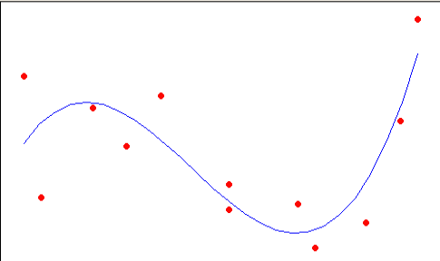
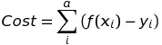
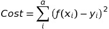
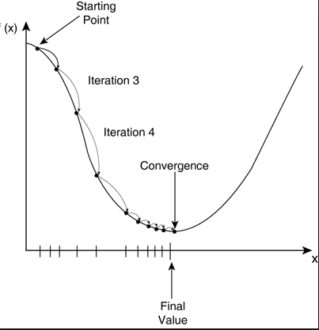
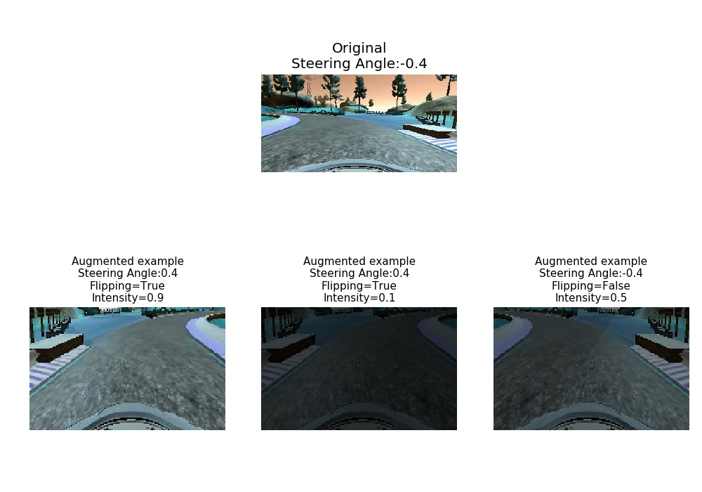

# Welcome to the Self Driving Car Workshop
In this project we will train a neural network to drive a car using the simulator provided by Udacity.


The whole exercise is structured into the following sections:
 1. How a neural network learns?
 2. Environment setup
 3. Dataset Preparation
 4. Neural Network implementation

## How a neural network learns?
Consider in a 2D space we have a distribution of points like in the plot below:



How could we identify the line that best fits all these points? Using Maths :smile:

Let's first define a generic function with unknown parameters:
```
f(x) = a + b·x + c·x² + d·x³
```
where ```a```, ```b```, ```c``` and ```d``` are constants.

These functions behave quite similar to our just defined function, [check it out in Google](https://www.google.es/search?ie=UTF-8&q=sin%28%x%29&gws_rd=cr&ei=GQBeWaSHDoe6Ucb9nKgJ#q=1+%2B+0.1*x+%2B+1.5*x^2+%2B+0.5*x^3,+-2+%2B+0*x+%2B+4.5*x^2+%2B+2.25*x^3), so we will try to find the parameters that best adjust to our points distributions. **IMPORTANT**, maybe you want to try another function that combines ```sin()``` and ```cos()``` :wink:.

Also, let's define a **Cost** function. The main goal of this function is to compute the distances between points and our function, that is:



In our case, let's define something bit complex but more realistic:



We want to compute the square error since we are not interested in the _direction_ of the error (positive or negative) but the _distance_, so we want to add up all distances without considering its sign.

OK, at this stage our goal is to **minimize the Cost function** :muscle:, but how to do that? We will use the Gradient Descent method.



Gradient Descent uses *derivatives* to identify local minimums in functions, for example, which is ```f'(x)``` when ```x=Final Value``` in the example above?

Let's jump to the notebook exercise:  **Gradient_Descent_exercise.ipynb** to identify the function weights to fit the points distribution in an exercise!

This is an [excellent paper that summarizes this topic](http://www.omgroup.edu.in/ejournal/Papers%20for%20E-Journal/PDF/2.pdf).

**Extra tip**: For those who want to know more on the mathematical side, [3blue1brown](https://www.youtube.com/watch?v=WUvTyaaNkzM&list=PLZHQObOWTQDMsr9K-rj53DwVRMYO3t5Yr) is a great channel!.

Could we use a function like ```f(x) = a + b·x + c·x² + d·x³``` to match any distribution? It doesn't seems so and that is why neural networks are so important. For example let's use [Tensorflow PlayGround](http://playground.tensorflow.org/#activation=tanh&batchSize=10&dataset=circle&regDataset=reg-plane&learningRate=0.03&regularizationRate=0&noise=0&networkShape=4,2&seed=0.67669&showTestData=false&discretize=false&percTrainData=50&x=true&y=true&xTimesY=false&xSquared=false&ySquared=false&cosX=false&sinX=false&cosY=false&sinY=false&collectStats=false&problem=classification&initZero=false&hideText=false) to visualize some examples that would be impossible to match with an equation like the one previously used.

This is a good introductory paper that describes [Gradient Descent on Neural Networks](http://www.omgroup.edu.in/ejournal/Papers%20for%20E-Journal/PDF/2.pdf).


## Environment setup:

Let's follow Udacity's instructions CarND starter-Kit:
 - [Configure Docker Environment](https://github.com/udacity/CarND-Term1-Starter-Kit/blob/master/doc/configure_via_docker.md#install-docker-on-your-computer)
 - [Udacity Self-Driving Car Simulator](https://github.com/udacity/self-driving-car-sim#welcome-to-udacitys-self-driving-car-simulator)


 Basically, instructions are summarized (for a Linux OS):
 ```
 docker pull udacity/carnd-term1-starter-kit
 mkdir taller_SDCNC
 cd taller_SDCNC
 docker run -it --rm -p 8888:8888 -v `pwd`:/src udacity/carnd-term1-starter-kit
wget https://d17h27t6h515a5.cloudfront.net/topher/2017/February/58983558_beta-simulator-linux/beta-simulator-linux.zip
 ```

 Once the simulator is downloaded, right click over the executable and click in the properties -> permissions -> Allow run as executable

 Estimated time to complete the installation: ~ 40 min


## Dataset Preparation:
 OK, so you are now ready to have some fun and drive the car :smile:. So, go ahead and drive safely avoid getting the tires off the road and try to drive as close as possible to the center road event during turns!.

 Now, open the notebook: ```Explore_data.ipynb``` to better understand the data that serves as input for the Neural Network.



## Neural Network implementation

Different deep convolutional neural nets architectures are used to perform this task, which nowadays seems to be the best known approach in the image recognition field. Working with Images is a complex task, for example, a grayscale image of size 150x150 would be transformed to a vector of size 150·150 = 22500 dimensions for a fully connected neural network. Such huge dimensionality with no predefined features makes this problem unapproachable for standard supervised machine learning approaches, even combining them with dimensional reduction techniques like PCA.


Convolutional nets are elected to be the most efficient technique to extract relevant information from, in this case, images to be used in classification tasks. When used for image recognition, convolutional neural networks (CNNs) consist of multiple layers of small kernels which process portions of the input image, called receptive fields. Kernels are small matrix (normally 3x3 or 5x5) applied over the input image to extract features from data, this technique has been used in image processing for decades, from Photoshop filters to medical imaging. This [blog by Victor Powell](http://setosa.io/ev/image-kernels/) is an excellent resource to understand how kernels works.


The outputs of these kernels are then tiled so that their input regions overlap, to obtain a better representation of the original image; this is repeated for every such layer. Convolutional networks may include local or global pooling layers, which combine the outputs of neuron clusters. Compared to other image classification algorithms, convolutional neural networks use relatively little pre-processing. This means that the network is responsible for learning the filters that in traditional algorithms were hand-engineered. The lack of dependence on prior knowledge and human effort in designing features is a major advantage for CNNs.
Another important concept of CNNs is pooling, which is a form of non-linear down-sampling. There are several non-linear functions to implement pooling among which max pooling is the most common. It partitions the input image into a set of non-overlapping rectangles and, for each such sub-region, outputs the maximum. The intuition is that once a feature has been found, its exact location isn't as important as its rough location relative to other features. The function of the pooling layer is to progressively reduce the spatial size of the representation to reduce the amount of parameters and computation in the network, and hence to also control overfitting. It is common to periodically insert a pooling layer in-between successive conv layers in a CNN architecture. The pooling operation provides a form of translation invariance.


On top of this, two different optimizers are employed: Adam and Adagram. Optimizers are used to minimize the Cost function in a neural net. In the example below, we can see there are weights (W) and biases (b) for every node and connection between nodes in a neural network:


A cost function is a measure of "how good" a neural network did with respect to it's given training sample and the expected output. It also may depend on variables such as weights and biases. A cost function is a single value, not a vector, because it rates how good the neural network did as a whole.
Specifically, a cost function is of the form:
C(W,B,S,E)
where W is our neural network's weights, B is our neural network's biases, S is the input of a single training sample, and E is the desired output of that training sample.
While there are different ways to represent the Cost function, the goal of optimization is to minimize it. Different approaches are used, Stochastic Gradient Descent (SGD) tries to find minimums or maximums by iteration. This is the most common approach and different versions of this method originates the optimizers here employed:
 * AdaGrad (for adaptive gradient algorithm) is a modified stochastic gradient descent with per-parameter learning rate, first published in 2011. Informally, this increases the learning rate for more sparse parameters and decreases the learning rate for less sparse ones. This strategy often improves convergence performance over standard stochastic gradient descent.
 * Adam is also a method in which the learning rate is adapted for each of the parameters. The idea is to divide the learning rate for a weight by a running average of their magnitudes and recent gradients for that weight.


 As previously mentioned, CNNs are the tool to use, so let's first desing a toy architecture that will allow us to test some initial results, let's propose a neural network with a single CNN layer and 4 dense layers and RELU activations:

 |Layer (type)                     |Output Shape          |Param #     |Connected to               |
 |:--------------------------------|:---------------------|:-----------|:--------------------------|
 |convolution2d_1 (Convolution2D)  |(None, 49, 99, 24)    |1176        |convolution2d_input_1[0][0]|
 |flatten_1 (Flatten)              |(None, 10752)         |0           |convolution2d_4[0][0]      |
 |dense_1 (Dense)                  |(None, 100)           |1075300     |flatten_1[0][0]            |
 |dropout_1 (Dropout)              |(None, 100)           |0           |dense_1[0][0]              |
 |dense_2 (Dense)                  |(None, 64)            |6464        |dropout_1[0][0]            |
 |dense_3 (Dense)                  |(None, 10)            |650         |dense_2[0][0]              |
 |dense_4 (Dense)                  |(None, 1)             |11          |dense_3[0][0]              |

 Total params: 1,152,869
 Trainable params: 1,152,869
 Non-trainable params: 0


Let's now jump to ```Model_training.ipynb``` to train our neural network!
