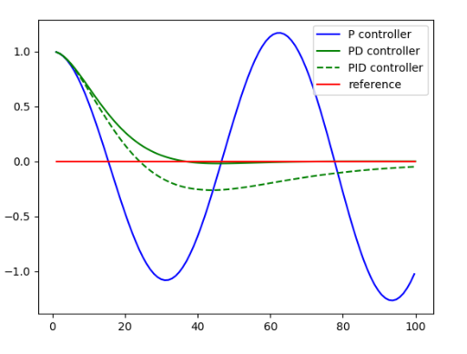
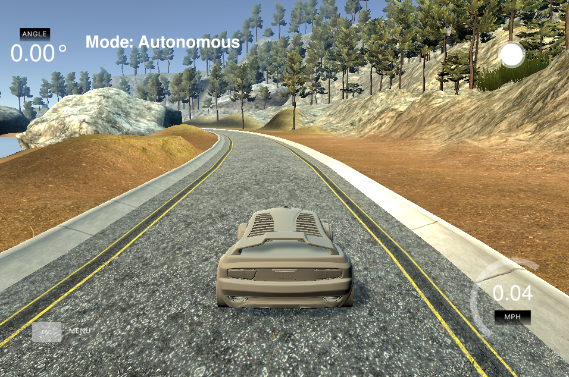

# CarND-Controls-PID
Self-Driving Car Engineer Nanodegree Program

---

## PID Control
PID controllers are simple reactive controllers that are widely used. The difference between the measured and the desired value (setpoint) of a process variable of a system is fed into the PID controller as an error signal. Depending on the PID parameters a control output is generated to steer the system closer to the setpoint. In the present project, a car simulator produces the error signal as the distance between the actual car position on the road and a reference trajectory, known as cross-track error (```cte```). The PID controller is designed to minimize the distance to this reference trajectory. The primary control output of the PID controller here is the steering angle.



**P - proportional gain**

The proportional term computes an output proportional to the cross-track error. A pure P - controller is unstable and at best oscillates about the setpoint. The proportional gain contributes a control output to the steering angle of the form ```-Kp * cte``` with a positive constant K_p.

**D - differential gain**

The oscillations caused by purely D control can be mitigated by a term proportional to the derivative of the cross-track error. The derivative gain contributes a control output of the form ```-Kd * d/dt cte```, with a positive constant K_d.

**I - integral gain**

A third contribution is given by the integral gain which simply sums up the cross-track error over time. The corresponding contribution to the steering angle is given by ```-Ki * sum(cte)```. Thereby, biases can be mitigated, for instance if a zero steering angle does not correspond to a straight trajectory. At high speeds this term can also be useful to accumulate a large error signal quickly, for instance when the car is carried out sideways from the reference trajectory. This allows to reduce proportional gain, which causes oscillations at high speeds. It is also beneficial to limit the memory of this term to avoid overshooting. Here, we used an exponentially weighted moving average for this purpose.

Combining all these values, we can resume the steering angle calculation as:
```
steering_angle = (-1) * (Kp * p_error + Kd * d_error + Ki * i_error);
```
**NOTE**: In this case, steering_angle is limited to the interval ```[-1, +1]```


## How ```Kp```, ```Kd```, ```Ki``` were selected?:
Although some automated processes could be included, just some try&error were implemented. The simulator was used to run the car along the circuit and for  each run a different combinations of parameters were tested.



Firstly, ```Kd``` and ```Ki``` were both set to 0, and once ```Kp``` was adjusted to produce decent results, I moved to the next parameter. In the end, the configuration used is:
```
Kp = 0.05
Kd = 0.005
Ki = 1.0
```

Also, some control was added to the car's throttle and brake to help keeping the car on the road and keep pushing were possible. This is the code used, which is quite self-explanatory:
```
throttle_value = 0.3;
if (speed > 5.) {
  if (fabs(steer_value) > 0.5 && fabs(cte) > 1.7) {
    throttle_value = -3.0;
  } else {
    throttle_value = 1.0;
  }
}
```

And this [Youtube Video](https://youtu.be/j5IJfrJ8Peg) includes the results.
