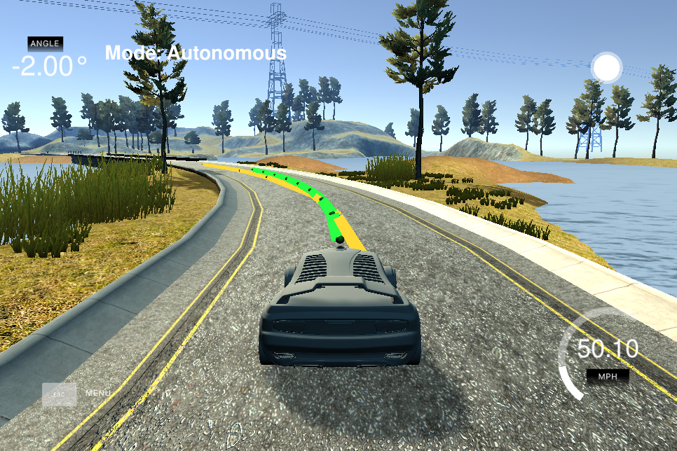
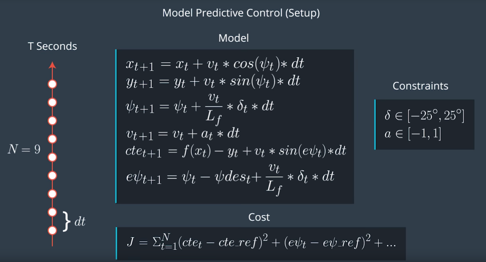
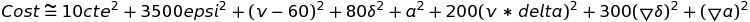

# CarND-Controls-MPC
Self-Driving Car Engineer Nanodegree Program

## Main Goal

This repository contains my solution to the Udacity SDCND MPC Project. The goal of this project is to navigate a track in a Udacity-provided [simulator](https://github.com/udacity/self-driving-car-sim/releases), which communicates telemetry and track waypoint data via websocket, by sending steering and acceleration commands back to the simulator. The solution must be robust to 100ms latency, as one may encounter in real-world application.

This solution, as the Nanodegree lessons suggest, makes use of the IPOPT and CPPAD libraries to calculate an optimal trajectory and its associated actuation commands in order to minimize error with a third-degree polynomial fit to the given waypoints. The optimization considers only a short duration's worth of waypoints, and produces a trajectory for that duration based upon a model of the vehicle's kinematics and a cost function based mostly on the vehicle's cross-track error (roughly the distance from the track waypoints) and orientation angle error, with other cost factors included to improve performance.



Yellow line indicates ideal route while green line is the polynomial approximation calculated.

## Implementation Details

The kinematic model includes the vehicle's ```x``` and ```y``` coordinates, orientation angle ```psi```, and velocity ```v```, as well as the cross-track error ```cte``` and psi error ```epsi```. Actuator outputs are acceleration ```a``` and steering angle ```delta```. The model combines the state and actuations from the previous timestep to calculate the state for the current timestep based on the equations below:



The values chosen for number of steps ahead ```N``` and timestep ```dt``` are 10 and 0.1 seconds, respectively. These values mean that the optimizer is considering a one-second duration in which to determine a corrective trajectory in timesteps of 0.1 seconds. Adjusting either ```N``` or ```dt``` (even by small amounts) often produced erratic behavior.

The waypoints are provided in order to determine the ideal road path that the car should follow as close as possible. These points are given in the map's coordinated, for such reason are processed by transforming them to the vehicle's perspective:
```
for (int i = 0; i < ptsx_veh.size(); i++) {
            double x = ptsx_veh[i] - px;
            double y = ptsy_veh[i] - py;
            ptsx_veh[i] = x * cos(psi) + y * sin(psi);
            ptsy_veh[i] = - x * sin(psi) + y * cos(psi);
          }
```

These waypoints, now in the vehicle coordinates system, simplifies the process to fit a polynomial to the waypoints because the vehicle's ```x``` and ```y``` coordinates are now at the origin (0, 0) and the orientation angle ```psi``` is also zero.

The polynomial equation is a third order function since it fits any car trajectory on the road:
```
//fit a polynomial to the above x and y coordinates
auto coeffs = polyfit(ptsx_veh, ptsy_veh, 3);
```

Once the coefficient are calculated, we can easily estimate ```cte``` and ```epsi```:
```
// calculate the cross track error
double cte = -polyeval(coeffs, 0);

// calculate the orientation error
double epsi = -atan(coeffs[1] + 2 * px * coeffs[2] + 3 * coeffs[3] * pow(px,2));
```
With this information and the constrains and cost function to minimize:



We can calculate the throttle and steering angle for the next state:
```
// define state:
Eigen::VectorXd state(6);
state << 0, 0, 0, v, cte, epsi;

// calculate MPC:
std::vector<double> mpc_output = mpc.Solve(state, coeffs);
```

Finally, like in any real system, there is a certain latency that needs to be considered in the current implementation, in this case latency is 100 ms. The approach to deal with it was to implement a delay for the received sensor measurements:
```
// predict state in 100ms
double latency = 0.1;
double Lf = 2.67;
px = px + v * cos(psi) * latency;
py = py + v * sin(psi) * latency;
psi = psi + v * delta / Lf * latency;
v = v + acceleration * latency;
```

Please, check the final implementation in this [Youtube video](https://www.youtube.com/watch?v=hLBxQIZsxz8).

---

## Dependencies

* cmake >= 3.5
 * All OSes: [click here for installation instructions](https://cmake.org/install/)
* make >= 4.1
  * Linux: make is installed by default on most Linux distros
  * Mac: [install Xcode command line tools to get make](https://developer.apple.com/xcode/features/)
  * Windows: [Click here for installation instructions](http://gnuwin32.sourceforge.net/packages/make.htm)
* gcc/g++ >= 5.4
  * Linux: gcc / g++ is installed by default on most Linux distros
  * Mac: same deal as make - [install Xcode command line tools]((https://developer.apple.com/xcode/features/)
  * Windows: recommend using [MinGW](http://www.mingw.org/)
* [uWebSockets](https://github.com/uWebSockets/uWebSockets)
  * Run either `install-mac.sh` or `install-ubuntu.sh`.
  * If you install from source, checkout to commit `e94b6e1`, i.e.
    ```
    git clone https://github.com/uWebSockets/uWebSockets
    cd uWebSockets
    git checkout e94b6e1
    ```
    Some function signatures have changed in v0.14.x. See [this PR](https://github.com/udacity/CarND-MPC-Project/pull/3) for more details.
* Fortran Compiler
  * Mac: `brew install gcc` (might not be required)
  * Linux: `sudo apt-get install gfortran`. Additionall you have also have to install gcc and g++, `sudo apt-get install gcc g++`. Look in [this Dockerfile](https://github.com/udacity/CarND-MPC-Quizzes/blob/master/Dockerfile) for more info.
* [Ipopt](https://projects.coin-or.org/Ipopt)
  * Mac: `brew install ipopt`
  * Linux
    * You will need a version of Ipopt 3.12.1 or higher. The version available through `apt-get` is 3.11.x. If you can get that version to work great but if not there's a script `install_ipopt.sh` that will install Ipopt. You just need to download the source from the Ipopt [releases page](https://www.coin-or.org/download/source/Ipopt/) or the [Github releases](https://github.com/coin-or/Ipopt/releases) page.
    * Then call `install_ipopt.sh` with the source directory as the first argument, ex: `bash install_ipopt.sh Ipopt-3.12.1`.
  * Windows: TODO. If you can use the Linux subsystem and follow the Linux instructions.
* [CppAD](https://www.coin-or.org/CppAD/)
  * Mac: `brew install cppad`
  * Linux `sudo apt-get install cppad` or equivalent.
  * Windows: TODO. If you can use the Linux subsystem and follow the Linux instructions.
* [Eigen](http://eigen.tuxfamily.org/index.php?title=Main_Page). This is already part of the repo so you shouldn't have to worry about it.
* Simulator. You can download these from the [releases tab](https://github.com/udacity/self-driving-car-sim/releases).
* Not a dependency but read the [DATA.md](./DATA.md) for a description of the data sent back from the simulator.


## Basic Build Instructions


1. Clone this repo.
2. Make a build directory: `mkdir build && cd build`
3. Compile: `cmake .. && make`
4. Run it: `./mpc`.

## Tips

1. It's recommended to test the MPC on basic examples to see if your implementation behaves as desired. One possible example
is the vehicle starting offset of a straight line (reference). If the MPC implementation is correct, after some number of timesteps
(not too many) it should find and track the reference line.
2. The `lake_track_waypoints.csv` file has the waypoints of the lake track. You could use this to fit polynomials and points and see of how well your model tracks curve. NOTE: This file might be not completely in sync with the simulator so your solution should NOT depend on it.
3. For visualization this C++ [matplotlib wrapper](https://github.com/lava/matplotlib-cpp) could be helpful.
